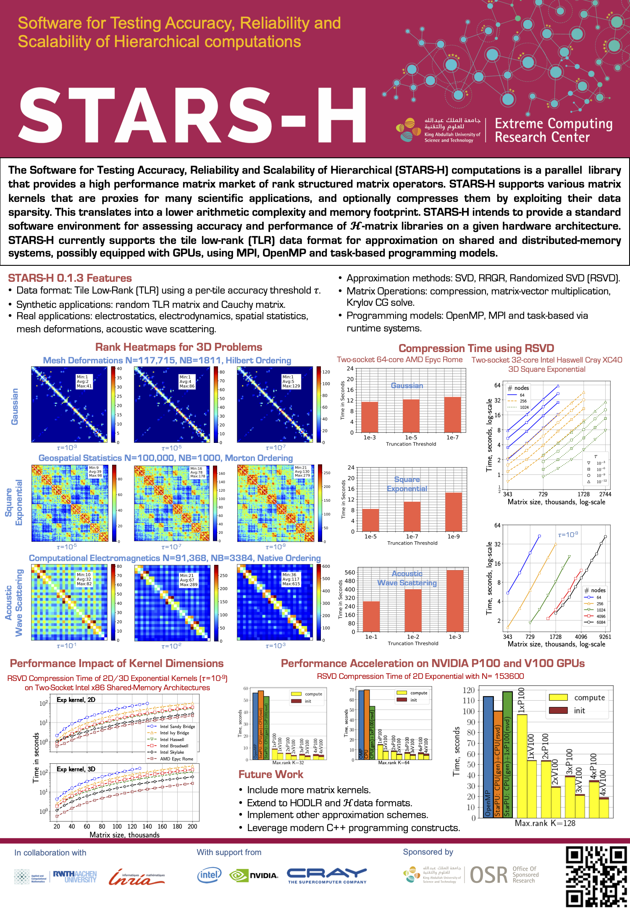

What is STARS-H?
================

STARS-H is a **high performance parallel open-source** package of **Software
for Testing Accuracy, Reliability and Scalability of Hierarchical
computations**. It
provides a hierarchical matrix market in order to benchmark performance of
various libraries for hierarchical matrix compressions and computations
(including itself). **Why hierarchical matrices?** Because such matrices arise
in many PDEs and use much less memory, while requiring fewer flops for
computations. There are several hierarchical data formats, each one with its
own performance and memory footprint. STARS-H intends to provide a standard for
assessing accuracy and performance of hierarchical matrix libraries on a given
hardware architecture environment. STARS-H currently supports the tile low-rank
(TLR) data format for approximation on shared and distributed-memory systems,
using MPI, OpenMP and task-based programming models.

Vision of STARS-H
=================

The vision of STARS-H is to design, implement and provide a community code for
hierarchical matrix generator with support of various data formats for
approximation, including, but limited to, TLR, HSS, HODLR, H and H^2. STARS-H
aspires to be for the low-rank approximation community what UF Sparse Matrix
Collection is for the sparse linear algebra community, by generating
hierarchical matrices coming from a variety of synthetic and real-world
applications. Furthermore, extracting the performance of the underlying
hardware resources (i.e., x86 and GPUs) is in the DNA of STARS-H, since the
approximation phase can be time-consuming on large-scale scientific
applications.

Current Features of STARS-H
===========================

This project is WIP, with current features limited to:

The only supported data format is Tile Low-Rank (TLR):
1.  TLR Approximation
2.  Multiplication of TLR matrix by dense matrix

Programming models (backends):
1.  OpenMP
2.  MPI
3.  Task-based using StarPU (with and without MPI)

Applications in matrix-free form:
1. Cauchy matrix
2. Electrostatics (1/r)
3. Electrodynamics (sin(kr)/r and cos(kr)/r)
4. Random synthetic TLR matrix
5. Spatial statistics (exponential, square exponential and matern kernels)

Low-rank approximation techniques (low-rank engines):
1. Ordinary SVD,
2. Rank-revealing QR,
3. Randomized SVD.

Additional:
1. CG method for symmetric positive-definite (SPD) systems.

TODO List
=========

1.  Add support for more matrix kernels and applications 
2.  Extend support to hardware accelerators (i.e, GPUs)
3.  Provide full StarPU support (GPUs and distributed-memory systems)
4.  Port to other dynamic runtime systems
5.  Implement additional low-rank routines like ACA.
6.  Implement additional formats: HODLR/H/HSS/H^2

Installation
============

Installation requires at least **CMake** of version 3.2.3. To build STARS-H,
follow these instructions:

1.  Get STARS-H from git repository

        git clone git@github.com:ecrc/stars-h

    or

        git clone https://github.com/ecrc/stars-h

2.  Go into STARS-H folder

        cd stars-h

3.  Get submodules

        git submodule update --init

4.  Create build directory and go there

        mkdir build && cd build

5.  Use CMake to get all the dependencies

        cmake .. -DCMAKE_INSTALL_PREFIX=/path/to/install/

6.  Build STARS-H

        make -j

7.  Run tests (optional)

        make test

8.  Build local documentation (optional)

        make docs

9.  Install STARS-H

        make install

10. Add line

        export PKG_CONFIG_PATH=/path/to/install/lib/pkgconfig:$PKG_CONFIG_PATH

    to your .bashrc file.

Now you can use pkg-config executable to collect compiler and linker flags for
STARS-H.

Examples
========

The directory `examples` contains two subfolders: `problem` and `approximation`.
The sources in `problem` show how to generate problems (e.g., spatial statistics, 
minimal or dense) and how to create STARSH\_problem instance, required for every 
step of STARS-H. The examples in `approximation` are based on problem generations 
and have additional steps on approximation of corresponding matrices.

*Important notice: the approximation phase does not require the entire dense matrix 
to be stored, since matrix elements are computed on the fly.*

